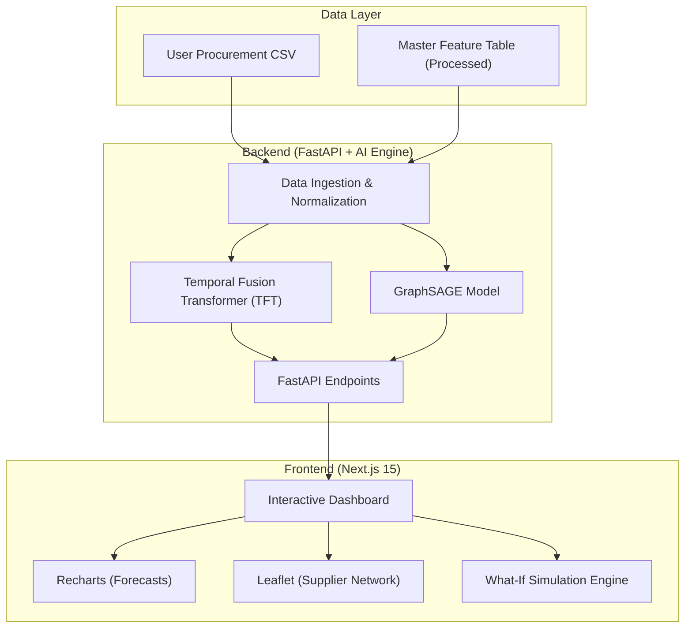

# PharmaSight: AI-Powered Drug Shortage Prediction & Supply Chain Intelligence

PharmaSight is a next-generation pharmaceutical intelligence platform designed to transform reactive supply chain management into proactive, AI-driven foresight. By harnessing state-of-the-art deep learning and graph neural networks, PharmaSight predicts shortages, simulates disruptions, and optimizes procurement cycles.

---

## 🏗️ System Architecture



---

## 🛑 The Problem: Supply Chain Fragility
Global pharmaceutical supply chains are under unprecedented stress. Fragmented data, opaque supplier networks, and unpredictable demand spikes lead to:
- **Shortage Crises**: Critical medications (e.g., antibiotics, oncology drugs) entering "out-of-stock" states without warning.
- **Cascading Failures**: A disruption at a single raw material manufacturer ripples through the entire network.
- **Reactive Procurement**: Hospitals often reorder only when shelves are empty, leading to inflated costs and patient risk.

## 💡 The Solution: Predictive Resilience
PharmaSight provides a unified interface to visualize and mitigate these risks before they manifest:
- **Probabilistic Forecasting**: Moving beyond "point estimates" to visualize uncertainty.
- **Disruption Simulation**: A "What-If" engine to stress-test your supply chain.
- **Network Observability**: A graph-based view of supplier dependencies.

---

## 🧠 Core Methodology

### 1. Temporal Fusion Transformer (TFT)
Unlike traditional ARIMA or LSTM models, the TFT is designed for **multi-horizon quantile forecasting**. It identifies which historical features (like CDSCO alerts or demand lags) are currently most important to the prediction, providing a "P10/P50/P90" range that accounts for uncertainty.

### 2. GraphSAGE (Graph Representation Learning)
We model the supply chain as a graph where nodes represent manufacturers, distributors, and hospitals. Using **GraphSAGE**, the system learns embeddings that quantify the "risk weight" of each node. By clicking a node in the dashboard, the system calculates how its failure would cascade across the entire healthcare network.

---

## 🛠️ Comprehensive Tech Stack

| Layer | Technologies |
| :--- | :--- |
| **Frontend** | Next.js 15 (App Router), React 19, TypeScript, Tailwind CSS |
| **Animation** | Framer Motion, Lucide Icons |
| **Visualization** | Recharts (Forecasting), Leaflet.js (Supplier Mapping) |
| **Backend** | FastAPI, Uvicorn, Pydantic |
| **ML/AI** | PyTorch Lightning, PyTorch Forecasting, Scikit-learn, XGBoost |
| **Data** | Pandas, NumPy, NetworkX (Graph Topology) |

---

## 📂 Documentation Index

### 🚀 Core Guides
- [**SETUP.md**](file:///c:/Users/vedan/Documents/My_Projects/PharmaSight%20-%20AI%20Powered%20Drug%20Shortage%20Prediction/SETUP.md): Environment setup and local deployment.
- [**BACKEND_BUILD_SUMMARY.md**](file:///c:/Users/vedan/Documents/My_Projects/PharmaSight%20-%20AI%20Powered%20Drug%20Shortage%20Prediction/BACKEND_BUILD_SUMMARY.md): API reference and AI model architecture.
- [**PROJECT_GUIDE.md**](file:///c:/Users/vedan/Documents/My_Projects/PharmaSight%20-%20AI%20Powered%20Drug%20Shortage%20Prediction/PROJECT_GUIDE.md): Functional walkthrough of all 7 dashboard modules.

### 🎨 Frontend & Design
- [Frontend Architecture Guide](file:///c:/Users/vedan/Documents/My_Projects/PharmaSight%20-%20AI%20Powered%20Drug%20Shortage%20Prediction/Frontend_ARCHITECTURE.md)
- [Frontend Build Summary](file:///c:/Users/vedan/Documents/My_Projects/PharmaSight%20-%20AI%20Powered%20Drug%20Shortage%20Prediction/Frontend_BUILD_SUMMARY.md)
- [Visual Features Showcase](file:///c:/Users/vedan/Documents/My_Projects/PharmaSight%20-%20AI%20Powered%20Drug%20Shortage%20Prediction/FEATURES_SHOWCASE.md)

### 🔬 Technical Deep-Dives (`docs/`)
- [Data Pipeline Explanation](file:///c:/Users/vedan/Documents/My_Projects/PharmaSight%20-%20AI%20Powered%20Drug%20Shortage%20Prediction/docs/data_pipeline_explanation.md)
- [Model Training Logic](file:///c:/Users/vedan/Documents/My_Projects/PharmaSight%20-%20AI%20Powered%20Drug%20Shortage%20Prediction/docs/model_training_explanation.md)
- [CDSCO Cleaning Methodology](file:///c:/Users/vedan/Documents/My_Projects/PharmaSight%20-%20AI%20Powered%20Drug%20Shortage%20Prediction/docs/data/cdsco_cleaning_methodology.md)

---

## 🌲 Project Structure

```text
.
├── app/                 # Next.js 15 App Router (Pages)
├── components/          # Reusable UI Components
├── data/                # Processed feature tables & model weights
├── docs/                # Detailed technical documentation
├── public/              # Static assets & icons
├── src/
│   ├── models/          # TFT and GraphSAGE architecture
│   ├── serving/         # FastAPI app scripts
│   └── preprocessing/   # Feature engineering pipelines
├── package.json         # Frontend dependencies
└── requirements.txt     # Backend dependencies
```

---

**Empowering Global Healthcare with AI-Driven Pharmaceutical Resilience.**
